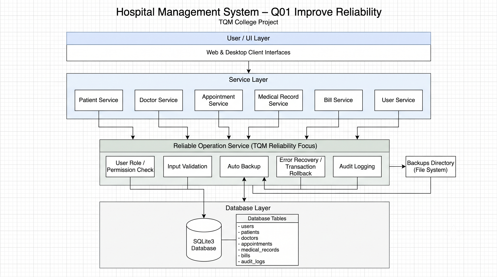

# Hospital Management System - Architecture

## 1. Overview

The Hospital Management System is a Python based desktop application developed as part of the BBAT104 Fundamentals of TQM project.

The system is designed to manage basic hospital information such as patients, doctors, appointments, medical records, users and billing.

The project uses SQLite as the database and Python services to perform the main operations.

For the assigned quality goal Q01, the project focuses on improving the reliability of database operations.

The five reliability features implemented in the system are:

* Automatic Backup
* Audit Log
* Input Validation
* Error Recovery
* User Roles

---

## 2. Technology Used

The main technologies used in the project are:

* Python 3.14.4
* SQLite3
* Pandas
* Matplotlib
* CustomTkinter
* Git
* GitHub

CustomTkinter is planned for the desktop user interface, while the current implementation mainly focuses on the database and service layer.

---

## 3. System Architecture

The system follows a simple layered architecture.

The following diagram shows the main layers and components of the Hospital Management System.


The service layer is responsible for performing the main hospital management operations.

The Reliable Operation Service connects the normal database operations with the Q01 reliability features.

---

## 4. Main Components

### 4.1 User Interface

The planned user interface will use CustomTkinter.

The interface will provide screens for login, dashboard and hospital management modules.

The GUI will communicate with the service layer instead of directly modifying the database.

---

### 4.2 Service Layer

The service layer contains separate services for the main hospital modules.

The current services include:

* Patient Service
* Doctor Service
* Appointment Service
* Medical Record Service
* Bill Service
* User Service

Each service is responsible for the CRUD operations related to its module.

This separation makes the project easier to maintain and test.

---

### 4.3 Reliable Operation Service

The `reliable_operation_service.py` acts as the main integration point for the Q01 reliability features.

Before a database write operation is completed, the service can perform the following steps:

```text
Check Permission
      |
      v
Validate Input
      |
      v
Create Backup
      |
      v
Execute Database Operation
      |
      v
Create Audit Log
```

If the operation fails, the error recovery mechanism performs a rollback where possible and records the failed operation.

---

### 4.4 Patient Management

The patient service manages patient information.

The supported operations are:

* Create patient
* View patients
* Update patient
* Delete patient

Patient input is checked using the validation service before database operations are performed.

---

### 4.5 Doctor Management

The doctor service manages information about doctors.

The supported operations are:

* Create doctor
* View doctors
* Update doctor
* Delete doctor

Doctor data is validated before it is stored in the database.

---

### 4.6 Appointment Management

The appointment service manages appointments between patients and doctors.

An appointment contains information such as:

* Patient
* Doctor
* Appointment date
* Appointment time
* Reason
* Status

Foreign key constraints are enabled in SQLite so that appointments cannot reference invalid patients or doctors.

---

### 4.7 Medical Records

The medical record service manages patient medical records.

A medical record contains information such as:

* Patient
* Doctor
* Diagnosis
* Prescription
* Notes
* Record date

Access to medical record operations can be controlled using the role service.

---

### 4.8 Billing

The bill service manages basic patient billing information.

A bill contains:

* Patient
* Amount
* Payment status
* Bill date

The validation service checks the billing information before it is stored.

For example, a negative bill amount is rejected by the validation layer.

---

### 4.9 User Management

The user service manages application users.

Each user has:

* Username
* Password hash
* Role
* Account status
* Creation date

The available roles in the current implementation are:

* Admin
* Doctor
* Staff

The role service checks whether a user has permission to perform a particular operation.

---

## 5. Database

SQLite3 is used because the project is a desktop based academic application and does not require a separate database server.

The database currently contains the following tables:

```text
users
patients
doctors
appointments
medical_records
bills
audit_logs
```

The database connection enables SQLite foreign key support.

This helps maintain relationships between patients, doctors, appointments and medical records.

---

## 6. Q01 Reliability Features

### 6.1 Automatic Backup

The backup service creates a copy of the SQLite database before important write operations.

The backups are stored in the project's `backups` directory.

Example:

```text
backups/
    hospital_backup_YYYYMMDD_HHMMSS.db
```

The timestamp helps identify when each backup was created.

The backup service also provides functions to list and restore available backups.

---

### 6.2 Audit Log

The audit service records important database operations.

An audit record can contain:

```text
User ID
Action
Module
Record ID
Description
Date/Time
```

Both successful and failed operations can be recorded.

The audit logs are stored in the `audit_logs` table.

This provides traceability and helps identify what operation was performed.

---

### 6.3 Input Validation

Input validation is performed before data is written to the database.

The validation service contains separate validation functions for the main modules.

Examples include:

* Required fields
* Patient age range
* Phone number format
* Doctor email format
* Bill amount validation
* User role validation

Invalid input is rejected before the database operation is executed.

For example:

```text
Bill Amount = -500

        |
        v

Input Validation

        |
        v

Validation Failed

        |
        v

Database Operation Stopped
```

---

### 6.4 Error Recovery

Database operations are executed through the error recovery service.

If an exception occurs:

```text
Database Operation
        |
        v
     Exception
        |
        v
     Rollback
        |
        v
Return Error Information
```

The purpose is to prevent partially completed database operations and provide a controlled error response.

---

### 6.5 User Roles

The role service provides role-based permission checking.

The current roles are:

| Role   | General Access                                |
| ------ | --------------------------------------------- |
| Admin  | Full system access                            |
| Doctor | Patient and medical record related operations |
| Staff  | Operational hospital management functions     |

The permission check is performed before a protected database operation.

If the user does not have the required permission, the operation is stopped.

---

## 7. Database Operation Flow

The general reliable operation flow is:

```text
User Request
     |
     v
Check User Permission
     |
     v
Validate Input
     |
     v
Create Database Backup
     |
     v
Execute Database Operation
     |
     +----------------------+
     |                      |
   Success                 Error
     |                      |
     v                      v
Commit                  Rollback
     |                      |
     v                      v
Create Audit Log       Failed Audit Log
     |                      |
     +----------+-----------+
                |
                v
          Return Result
```

This flow combines the Q01 features with the normal database operation instead of treating reliability as a separate part of the system.

---

## 8. Project Structure

The main project structure is:

```text
BBAT104_TQM_AU-24-7632/
│
├── app/
│   ├── database/
│   │   └── db.py
│   │
│   ├── models/
│   │
│   └── services/
│       ├── patient_service.py
│       ├── doctor_service.py
│       ├── appointment_service.py
│       ├── medical_record_service.py
│       ├── bill_service.py
│       ├── user_service.py
│       │
│       ├── backup_service.py
│       ├── audit_service.py
│       ├── validation_service.py
│       ├── error_recovery_service.py
│       ├── role_service.py
│       └── reliable_operation_service.py
│
├── database/
│   └── hospital.db
│
├── backups/
│
├── docs/
│   ├── ARCHITECTURE.md
│   ├── DATABASE_DESIGN.md
│   ├── SRS.md
│   └── USER_MANUAL.md
│
├── tests/
│   ├── test_crud.py
│   └── test_q01_reliability.py
│
├── README.md
└── .gitignore
```

---

## 9. TQM Integration

The architecture supports the TQM requirements of the project.

The system provides data and evidence that can later be used for:

* Defect logging
* Checksheets
* FMEA
* Pareto analysis
* Fishbone analysis
* PDCA

The reliability features also support important TQM principles such as:

* Error Prevention
* Fact-Based Decision Making
* Process-Centric Approach
* Continuous Improvement

For example, audit logs and test results provide factual information that can be used during quality analysis.

---

## 10. Testing

The project includes automated tests for CRUD operations and Q01 reliability features.

The Q01 reliability test suite checks:

* Input validation
* Bill validation
* User role permissions
* Database backups
* Audit logs
* Error recovery and rollback

The current Q01 regression test result is:

```text
12 tests passed
0 tests failed
```

This provides evidence that the implemented reliability features are working with the current service layer.

---

## 11. Future Development

The next stages of the project will focus on completing the desktop interface and the remaining TQM analysis activities.

These include:

* CustomTkinter based GUI
* SIPOC analysis
* FMEA and RPN calculation
* Defect logging
* Pareto analysis
* Fishbone analysis
* Checksheets
* PDCA based improvement

Any major architecture changes made during development will be documented in the repository.

---

## 12. Summary

The Hospital Management System uses a simple layered architecture consisting of the user interface, service layer, reliability layer and SQLite database.

The Q01 reliability features are integrated into the database operation process.

Input validation helps prevent incorrect data, user roles restrict unauthorized operations, automatic backups reduce data-loss risk, error recovery handles failed transactions, and audit logging provides traceability.

This architecture keeps the project simple enough for the academic requirements while providing clear evidence of the assigned TQM quality goal: **Improve Reliability**.
