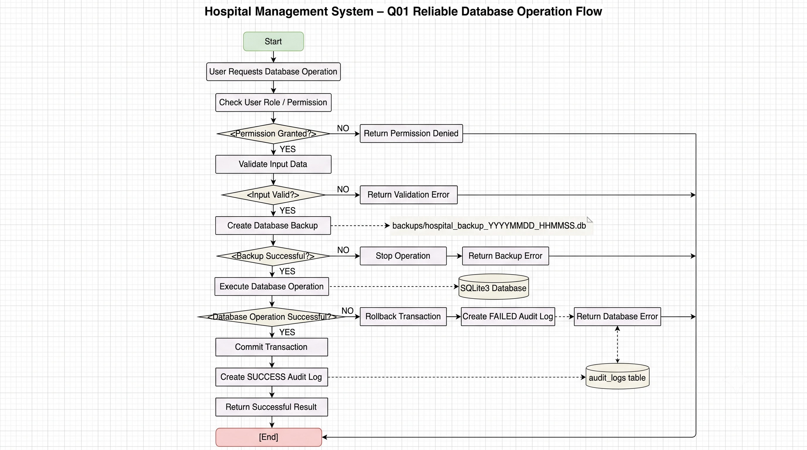

# Hospital Management System - Q01 Reliability Flowchart

## 1. Overview

This flowchart shows how a database operation is handled in the Hospital Management System.

The flow mainly shows the Q01 reliability features added to the system.

The main steps are:

* User permission check
* Input validation
* Database backup
* Database operation
* Error recovery
* Audit logging

The purpose of this flow is to make database operations more reliable and reduce the chance of incorrect or lost data.

---

## 2. Reliable Database Operation Flow

The following flowchart shows how the Q01 reliability features are applied during a database operation.



## 3. Explanation of the Flow

### Step 1 - User Request

The process starts when a user requests an operation such as creating, updating or deleting a hospital record.

---

### Step 2 - Permission Check

The system checks the user's role before performing the operation.

If the user does not have the required permission, the operation is stopped.

---

### Step 3 - Input Validation

The input data is checked before it reaches the database.

If the data is invalid, the system returns a validation error and does not continue with the database operation.

---

### Step 4 - Database Backup

A backup of the SQLite database is created before an important write operation.

This provides a recovery point in case something goes wrong during the operation.

---

### Step 5 - Database Operation

The requested operation is executed through the database/service layer.

The database operation is handled using transaction control.

---

### Step 6 - Error Recovery

If the database operation fails, the transaction is rolled back.

The failed operation is also recorded in the audit log.

This helps prevent incomplete database changes.

---

### Step 7 - Successful Operation

If the operation is successful, the transaction is committed.

A successful audit entry is then created.

The final result is returned to the user.

---

## 4. Q01 Features Shown in the Flowchart

| Flowchart Step         | Q01 Feature      |
| ---------------------- | ---------------- |
| Check User Role        | User Roles       |
| Validate Input         | Input Validation |
| Create Database Backup | Automatic Backup |
| Rollback Transaction   | Error Recovery   |
| Create Audit Log       | Audit Log        |

This shows how the five assigned reliability features work together during a database operation.

---

## 5. Example

For example, suppose a staff user tries to create a new patient record.

The system will follow this process:

```text
Staff User
    |
    v
Check Permission
    |
    v
Validate Patient Data
    |
    v
Create Backup
    |
    v
Save Patient
    |
    v
Commit Transaction
    |
    v
Create Audit Log
    |
    v
Show Successful Result
```

If the patient data is invalid, the operation stops at the validation stage.

If the database operation fails, the transaction is rolled back and the failed operation is recorded.

---

## 6. Purpose of the Flowchart

The flowchart represents the reliability process implemented around the normal CRUD operations.

It demonstrates that the system does not simply send data directly to SQLite.

Instead, important checks are performed before and after the database operation.

This supports the Q01 quality goal of:

**Improve Reliability**

The flowchart can also be used as supporting evidence during the TQM review and final viva.
